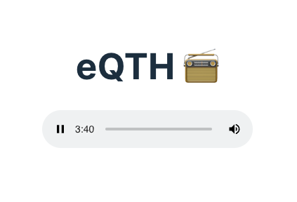

# eqth-client

## Requirements
You need these things installed:
1. Node
2. NPM

## Setup
Run `npm install` to install the Node dependencies.
Run `npm run dev` to run the development server locally.
